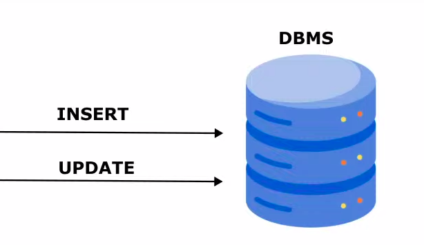

### JDBC , JPA, HIBERNATE

* JDBC is the raw way to make java connection.
* JPA is a  specification. It tells how to implement the database libraries.
* Hibernate is the implementation of this specification
  provided by JPA.

When we insert and update into a database,
it typically executes two query.
However, when we use jdbc, 
this thing works differently.

In this lesson, we will create a basic Hibernate
connection. We will use postgres as our database.

