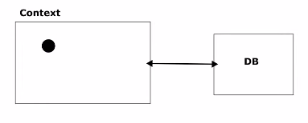

## The context

When we work with hibernate
we should keep in mind that we
are working with context. 
Not with the database. The
context is the intermediary thing between our application and database.
The context is the container of all the
instances hibernate should be aware of. We do not need to consider
database. 
We need an entity manager for manage the context in both direction.
From the app to the context and vice versa.

```java
import jakarta.persistence.EntityManager;
import jakarta.persistence.EntityManagerFactory;
import org.hibernate.jpa.HibernatePersistenceProvider;
import persistance.CustomPersistanceUnitInfo;

import java.util.HashMap;

public class JPAXMLConfiguration {
    public static void main(String[] args) {

        EntityManagerFactory emf =
                new HibernatePersistenceProvider()
                        .createContainerEntityManagerFactory(
                                new CustomPersistanceUnitInfo(),
                                new HashMap<>()
                        );
        
        EntityManager em = emf.createEntityManager(); // represents the context

        try{
            em.getTransaction().begin();
            
            em.find
            
            em.getTransaction().commit();
        }finally {
            em.clear();
        }
    }
}
```
For example, to retrieve an entity from the database, we first need to create an entity manager.
Then we find the instance with find method. This will extract the
instance of product from database and make it part of the context
once we have done that.

When we create a context, we must close the context. The spring 
data jpa automatically close this context for us. 



When we call the instance by using its primary key, it will store the
instance in the context. Now, if we call the same instance with the primary key,
it will not call the database. Rather it will be read from the context rather
make an additional call. 

```java
  try {
      em.getTransaction().begin();

      Product product = em.find(Product.class, 34L);
      product.setName("Jawwad");
      System.out.println(product);
      em.getTransaction().commit();
    } finally {
      em.clear();
    }
  }
```

Now let's say I change the name field of the retrieved context.
In this case, if I set an updated value in the name field and
restart my application, I will see that the database also
updated the row corresponding the primary key.
In case of hibernate, there is no update operation.The hybernate
will automatically commit the changes at the end using commit method.
It will observe the instance whether there is any change on it or not
and base on the change, it will update its value on the database.

If there is any scenario when the instance changes but somehow, the change does not
have any difference with its previous state, to hibernate will not commit it
to the database. Since the instance's value did not have any noticeable change,
to hibernate will not update its value to the database.

Using remove method, we can remove it from database.

```java
em.remove(e1); // here e1 is an instance of product that was retrieved from db.
```
There are several operation we will discuss.

```java
em.persist(); // -> Adding entity on context
em.find(); // -> find instance of en entity from db and add it to the context if it does not exist.
em.removerge(); // marking entity for removal.
em.merge(); // Merges the entity from outside of the context to the context. The entity must exits in the database.
em.refresh(); // mirror the context from the database.
em.detach(); // taking the entity out of the context.
```


