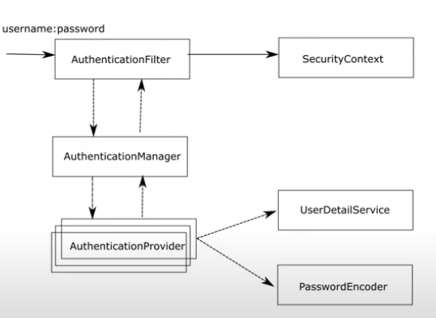
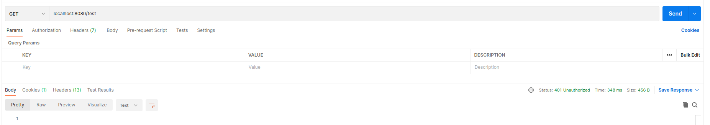
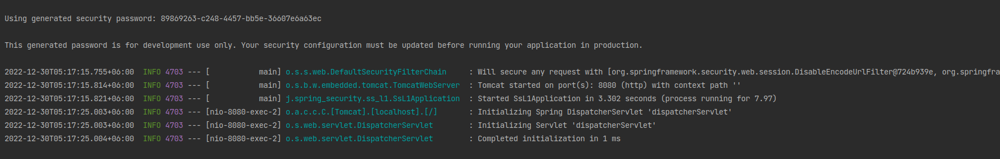

# Sprint security : lesson 01

This is the first chapter of spring security.
In this chapter we will mainly discuss core concept of authentication,
authorization and some basic fundamental keyword of spring security.

### Authentication
Authentication is the process of verifying that someone or something is who or what it is claimed to be. In the context of computer security, authentication is the process of verifying the identity of a user, device, or system in order to grant access to a network, system, or application.

There are several methods of authentication that can be used, including:
* Something you know: This could be a password, a PIN, or a security question.
* Something you have: This could be a physical token, such as a key card or a security key, or a digital token, such as a one-time password (OTP) sent to your phone or email.
* Something you are: This could be a biometric factor, such as a fingerprint, a facial scan, or a voice-print.

The most effective authentication systems often use a combination of these methods for added security. For example, a system may require a user to enter a password and also provide a fingerprint or use a security key.
In general, the goal of authentication is to ensure that only authorized users or devices can access a network, system, or application, and to prevent unauthorized access.

### Authorization
Authorization is the process of granting or denying access to specific resources or actions within
a system or application. It is typically used in conjunction with authentication, which verifies the identity of a user, device, or system.

Once a user has been authenticated and their identity has been verified, the authorization process 
determines what actions or resources the user is allowed to access.
This can be based on a number of factors, including the user's role or privileges within the system, their access level, or the specific permissions that have been granted to them.

For example, a user with the role of "administrator" might have full access to all resources 
and actions within a system, while a user with the role of "guest" might only be granted access 
to certain resources or actions.

In general, the goal of authorization is to ensure that users or devices only have access 
to the resources and actions that they are authorized to use, and to prevent unauthorized access to sensitive or restricted areas.

### Authentication in Spring security

In spring security , authentication is done with something called `AuthenticationFilter`. `AuthenticationFilter` is a
combination of multiple filter chain which we will discuss in later chapter of this repo.

When any request is received by the `AuthenticationFilter` , it authenticates this request using 
`authenticationManager`. The `AuthenticationManager` then delivers 
the responsibility to `AuthenticationProvider`. The AuthenticationManager might have one or more
`AuthenticationProvider`. The AuthenticationManager decides which provider should be used to authenticate 
any request.
We have authentication logic in  AuthenticationProvider.

Spring security offers a basic authentication mechanism where user can provide username and password to
authenticate. So, the spring security somehow need to find whether the username and password is correct or
not. SpringSecurity finds the user using `UserDetailService`. This is an interface we can implement it
to find the user from any database for the AuthenticationProvider. Finally, there is another interface 
called `PasswordEncoder` that is used to check the password provided by the user.
The password is compared with the userDetailService using any hashing algorithm.
This interface is also used by `AuthenticationProvider`.

If the username and password is correct, the information goes to reverse way to AuthenticationManager,
AuthenticationManager to AuthenticationFilter. And in the end this credential is saved in as
SecurityContext object in our system.

Now we will create an end point and secure it with spring security.
Let's create a controller [TestController](src/main/java/jawwad/spring_security/ss_l1/controller).
If we run this application, we will notice that spring security provides some default configuration. 
As we've added spring security as a dependency in our pom.xml file, spring did this autoconfiguration
for us. Now we have to override this autoconfiguration.

When we run this application, and try to hit this end point with post man , we will get an unauthorized error
in our response.

This happens because the spring security did some autoconfiguration for us . It provided a default username
and password when we started our application. The default username is `user' and the password is an
auto-generated UUID ID printed on the console.

The initial configuration that spring security provides us is basic authentication . We can use this
credential to authenticate in the application.
The spring security will then authenticate the request based on this credential. It will match the password
from the request and authenticate with some logic. All this steps come from the default configuration that
spring provides us. The default configuration uses `BasicAuthenticationFilter`.

